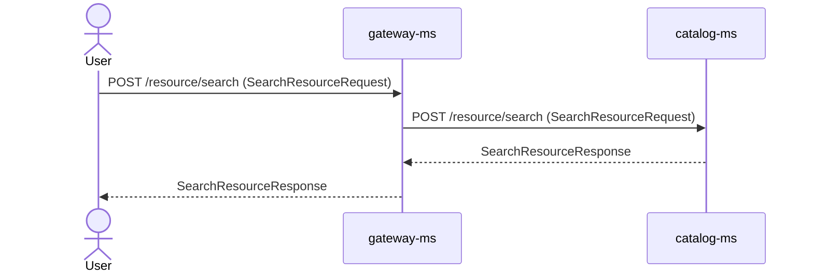
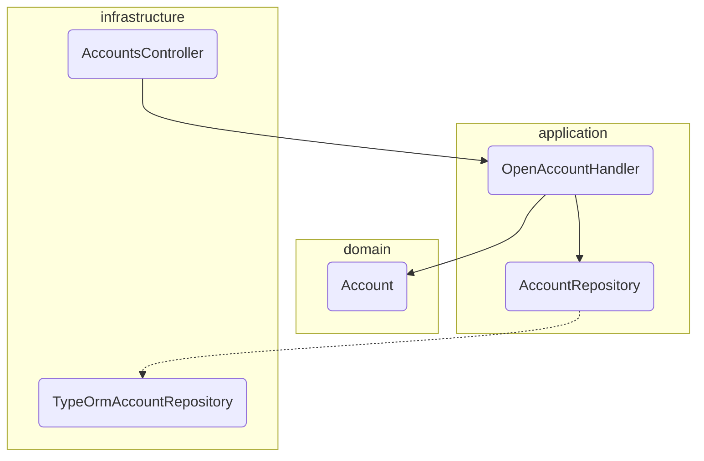

# Story diagrams — generic floor (Mermaid)

Two files, both under `work/active/spec-<number>/docs/`. `diagram.md` belongs to this
story; `component.md` accumulates into the module's living docs.

---

## File 1 — `docs/diagram.md`

````markdown
# Flow diagram: spec-<number>


````

---

## File 2 — `docs/component.md`

Grouped by hexagonal layer, one node per component. This file is promoted to
`<DOCS_MODULE>/<module>/component.md`, where it accumulates across stories.

````markdown
# Components: <module>


````

## Rules

- **Label every arrow with the method, the path and the schema name**, spelled exactly as
  the API contract spells them. A label the contract does not carry is a design that
  drifted.
- `->>` is a request, `-->>` is a response. The initiating actor is a participant, and
  internal hops between components are shown too.
- **The visible name is what the diagram gate resolves**, not the alias: in
  `participant CB as CommandBus`, `CommandBus` is what must exist in the code.
- In a `flowchart`, the shape declares the node class: `X("Name")` must resolve;
  `X[("table")]` (cylinder) and `subgraph` don't.
- External actors (`User`, `Postgres`, `Keycloak`) are exempt from the gate.
- Diagrams are grouped by layer (`domain` / `application` / `infrastructure`). Prose and
  labels follow `ARTIFACT_LANGUAGE`; every identifier stays verbatim from the code.
