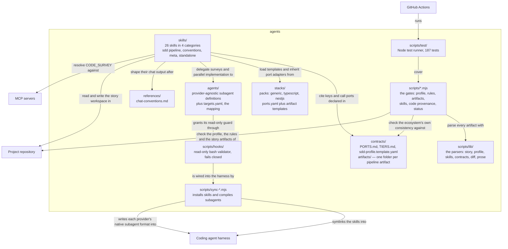

# Containers (C4 Level 2)

The units inside the boundary and the real relationships between them. Nothing here
is deployed to a server: this system is distributed by being installed into a
harness, so a container is a directory with one owner and one reason to change.
This file changes whenever such a unit or an integration is added or removed.
Last updated: 2026-08-17.

## Containers

| Container | Responsibility | Changes when |
|---|---|---|
| `skills/` | The pipeline stages (`/sdd-spec` → `/sdd-commit`), the convention guides and the meta tooling. This is the domain: a skill names a capability, never a tool. Which stages a given story runs is its **execution tier** (`full` / `standard` / `fast`), declared in `spec.md`'s front matter and orthogonal to the carril that decides how a criterion is closed. | A stage's behavior, a gate or a convention changes. |
| `agents/` | Subagent definitions carrying a model `tier` (`reasoning` / `balanced` / `fast`, unrelated to a story's execution tier) and a list of `capabilities` — no model, no tool names. `targets.yaml` translates both into each provider's vocabulary. Delegation is reserved for fan-out (a `[P]` group per agent) and for discardable bulk (a code survey); sequential drafting stays in the main agent. | A delegation is added, or a provider's model mapping changes. |
| `contracts/` | What more than one skill must agree on. The port catalog, the execution-tier catalog and the profile schema, and one folder per pipeline artifact (`artifacts/<artifact>/`) holding its rules, its floors and the skills that produce and consume it. A port invented in a skill fails validation because it is absent here; a producer or a consumer renamed without its contract fails for the same reason. | A capability, a profile key or an artifact's rule is added or changes owner. |
| `stacks/` | Per-stack wiring — the port adapters a project of that stack usually needs, plus the artifact templates. Layered base → specific. | A stack is added, or its idiom changes. |
| `references/` | Prose conventions shared by every skill's conversational output. | The six output blocks change. |
| `scripts/*.mjs` | The gates, run as commands: they enforce mechanically what the skills state in prose. | A contract acquires a rule worth enforcing. |
| `scripts/sync-*.mjs` | The installers. They bridge a source tree organised by owner to the flat, per-provider trees the harnesses read, using symlinks and generated files. | A harness changes where or how it reads definitions. |
| `scripts/lib/` | The parsers every gate shares — story, profile, skills, contracts, diff, prose. | An artifact's structure changes. |
| `scripts/hooks/` | The read-only guard for Claude Code: every `Bash` command from a read-only subagent goes through it, and it blocks whatever it cannot parse. | The guard's threat model changes. |
| `scripts/test/` | The suite, including one integration test asserting this repo passes its own validator. | Any of the above changes. |

## Data stores

There are none. All state is files: the ecosystem's own sources, and — in the project
being worked on — the story workspace under `work/active/` and `work/done/`, which
lives outside this boundary and is owned by the repository the pipeline runs against.

## Integrations

The three edges that cross the boundary are the ones worth watching. `sync` writes
into the harness's own directories, so a change to where Claude Code or OpenCode reads
definitions breaks installation, not the pipeline. The skills read and write the
project repository, which is why nothing project-specific may live here. And
`CODE_SURVEY` is the only port whose adapter chain reaches an MCP server, degrading to
a subagent and then to inline reading when it is absent — depth changes, availability
does not.
