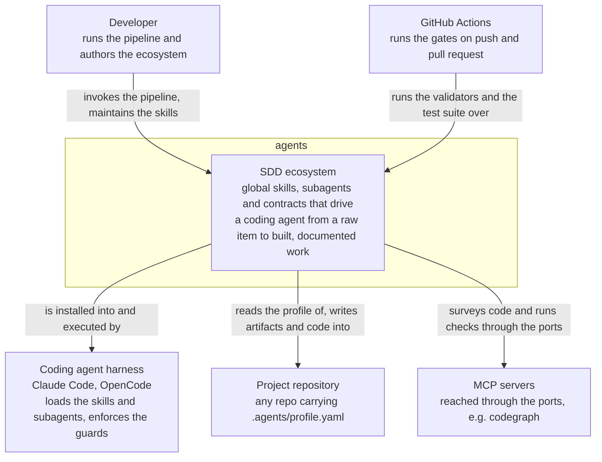

# System Context (C4 Level 1)

The whole ecosystem as a single box: who drives it, and which systems outside its
boundary it talks to. No skill, script, agent or pack appears at this level — those
are `containers.md`. This file changes only when an actor or a real external
integration is added or removed. Last updated: 2026-08-17.

## Actors

| Actor | Relationship |
|---|---|
| Developer | The only human actor. Invokes the pipeline as slash commands, answers the questions each stage escalates, and authors the skills, subagents and contracts themselves — this repository is both the tool and the thing being worked on. |

## External systems

| System | Why it is outside the boundary |
|---|---|
| Coding agent harness | Claude Code and OpenCode execute the skills; the ecosystem only writes definitions into the locations each one reads. Neither harness is versioned here, and a third could be added by a mapping alone. |
| Project repository | The pipeline acts on repositories that are not this one. What adapts the global skills to each is that repo's own `.agents/profile.yaml`; nothing project-specific lives inside the boundary. |
| MCP servers | Optional capability providers, wired per project through the `ports` block. A server that is absent from the session degrades a port to a shallower adapter rather than breaking the pipeline. |
| GitHub Actions | Runs the same gates a developer runs locally, on Linux and Windows both. It adds no check of its own — what it adds is the guarantee that the existing ones ran. |

The npm registry supplies one build dependency (`js-yaml`) and is deliberately absent
from the diagram: a package install is not an integration.
