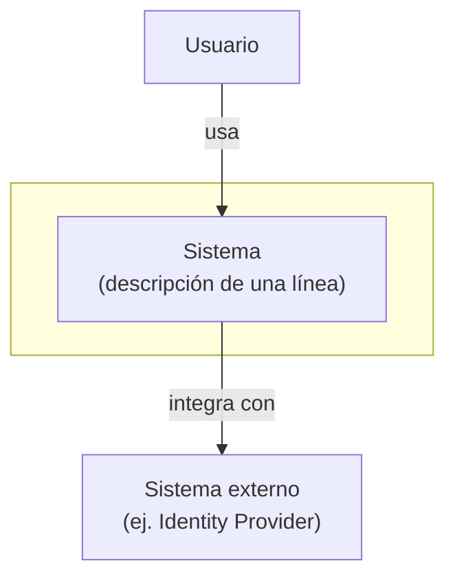

# architecture

## Perfil del proyecto (leer primero, siempre)

Antes de cualquier otra cosa, leé `.agents/profile.md` (en la raíz del proyecto actual): define
`PROJECT_NAME`, `DIAGRAM_FORMAT`, `OUTPUT_LANGUAGE` y `WORKDIR_DONE`. Si no existe, avisá al
usuario que lo cree copiando `~/.agents/sdd-profile.template.md` a `.agents/profile.md` del
proyecto, y detené: sin perfil no conocés las convenciones de este proyecto.

**Los literales de este documento son solo un ejemplo de resolución** (el perfil de admin-back).
Los valores reales salen del `profile.md` del proyecto en el que estés trabajando — si difieren, mandan los del perfil:

| En este documento | Clave en profile.md |
|---|---|
| `hu-<number>` | `STORY_ID_PATTERN` |
| `work/done/hu-<number>/` | `WORKDIR_DONE` |
| Mermaid | `DIAGRAM_FORMAT` |
| salida en español | `OUTPUT_LANGUAGE` |
| `docs/architecture/` | `DOCS_ARCHITECTURE` |

---

## Overview

Owns two files, both scoped to the whole system (never a single module):

- **`docs/architecture/context.md`** (C4 Level 1 — System Context): who uses
  the system and which external systems it talks to. No internal detail at
  all — no apps, no DBs, no modules. Changes rarely (only when an actor or a
  real external integration is added/removed).
- **`docs/architecture/containers.md`** (C4 Level 2 — Container): the
  apps/microservices, the shared libs, the databases, and the integrations
  between them. Changes whenever a microservice, a lib, or an integration is
  added/removed.

Level 3 (Component, per module) and each story's sequence diagram **don't**
live here — they're `/design`'s job to produce and `/sync`'s job to promote
to `apps/<app>/docs/<module>/`, because they describe a module's interior,
not global architecture.

**Two modes:**

1. **Bootstrap** — `docs/architecture/` doesn't exist or is empty. Scans the
   repo and generates initial `context.md` + `containers.md`.
2. **Update** — invoked with `hu-<number>` (normally `/sync` invokes it
   automatically when it reads a "Sí" in design.md's "Impacto en
   Arquitectura Global" section). Surgically edits whichever file applies
   (`context.md` if an actor/external integration changed, `containers.md`
   if an app/microservice/lib/internal integration changed) using the
   node/edge `design.md` already specified.

**Announce at start:** "Bootstrapeando `docs/architecture/`." (Bootstrap
mode) or "Actualizando `docs/architecture/` con hu-<number>." (Update mode).

**Output:** `docs/architecture/context.md` and/or
`docs/architecture/containers.md` created or updated.

---

## CRITICAL: Never regenerate a full diagram in Update mode

In Update mode, edit **only** the nodes/edges affected by the story, in
whichever file applies (`context.md` or `containers.md` — not both, unless
the change genuinely touches both levels). Preserve everything else exactly
as it was, including manual annotations the user may have added by hand.
Regenerating a whole diagram from scratch would destroy that work.

## CRITICAL: Don't mix C4 levels

`context.md` never mentions individual apps/microservices, DBs, or libs —
that's `containers.md`. If a story adds a new microservice, the change goes
in `containers.md`; it only also touches `context.md` if the change also
alters which actor/external system interacts with the system as a whole.

---

## Mode A: Bootstrap

Triggers when `docs/architecture/context.md` or `containers.md` don't exist
(first time in the project).

### Step 1: Survey the current topology

```bash
ls apps/ libs/ 2>/dev/null
```

For each app: identify its database (read the app's config/env), whether
it's synchronous HTTP or event-sourced, and its known integrations (adapters
under `infrastructure/adapters/` that talk to another app, an external
service, or a broker). For each lib: identify which apps consume it.
Also identify real external systems (identity provider, payment gateways,
third-party APIs) — those go in `context.md`, not each internal app.

If the repo has an Nx project graph, it can be used as extra reference:

```bash
npx nx graph --file=/tmp/graph.json 2>/dev/null
```

Not required — if unavailable, the manual survey of `apps/`/`libs/` is
enough.

### Step 2: Generate `context.md` (C4 Level 1)

A single box representing **the whole system** (without splitting internal
apps), the actor(s) that use it, and the real external systems it integrates
with. Example shape (adapt to the profile's `DIAGRAM_FORMAT`):



### Step 3: Generate `containers.md` (C4 Level 2)

One node per app/microservice, one node per relevant shared lib, one node
per database, and the same external systems from `context.md` but now with
the edge coming from the specific container(s) that actually call them
(not from the whole-system box). Edges for real integrations, not build
dependencies.

### Step 4: Save and report

Save both files under `docs/architecture/`, each preceded by a context line
(what it represents, when it was last generated/updated). Summary: paths
created, how many actors/external systems it surveyed for `context.md`, how
many apps/libs/DBs for `containers.md`.

---

## Mode B: Update

Triggers with `/architecture hu-<number>` — invoked by the user or, more
often, by `/sync` when closing a story whose `design.md` already answered
**Sí** in its `## Impacto en Arquitectura Global` section (`/design`
determines this at design time; `/sync` only reads and promotes it — no
heuristic detection involved).

### Step 1: Read the already-archived story

```
work/done/hu-<number>/design.md
work/done/hu-<number>/context.md
```

(If the story is still in `work/active/hu-<number>/` because this was
invoked before `/sync` archived it, read from there — not an error, it just
means this is running manually before the full close.)

### Step 2: Take the delta from `design.md`

`design.md`'s `## Impacto en Arquitectura Global` already carries the
affected level (Context/Container), the type of change, and the concrete
node/edge to add/remove — no need to re-derive it. If `/sync` invoked this
skill, it usually already passed it along in the invocation prompt; if run
manually, read it directly from that section.

If the section is missing or ambiguous about the exact node/edge (a story
designed before this convention existed), ask the user instead of guessing.

### Step 3: Edit surgically

Open whichever file applies and modify **only** the nodes/edges from the
Step 2 delta — add what's new, remove what no longer applies. Don't touch
the rest of the diagram, or the other file if the change doesn't belong
there.

### Step 4: Report

Summary: which file(s) were touched and what was added/removed from each.

---

## Examples

### Example 1: bootstrap in admin-back

User says: "/architecture"

Actions:
1. Neither `context.md` nor `containers.md` exist → Bootstrap mode.
2. `context.md`: one actor (Usuario) + one external system (Keycloak, IdP).
3. `containers.md`: `apps/finances` (monolith, own DB, frozen) and
   `apps/ledger` (event sourcing + CQRS, own DB, active), `libs/shared`,
   each app's integration with Keycloak.

Result: `docs/architecture/` gets created with the repo's current topology,
correctly split across the two levels.

### Example 2: /sync promotes a cross-cutting story already flagged by /design

Context: `/sync hu-0015` closes a story that added `apps/notifications`
(new microservice, consumes ledger events via a new adapter). It doesn't add
any new actor or external system. `design.md` already carries:

```markdown
## Impacto en Arquitectura Global

**¿Toca arquitectura global?** Sí.

- **Nivel:** Container (Nivel 2)
- **Cambio:** nuevo microservicio
- **Nodo/arista concreto:** agregar nodo `notifications`; arista
  `ledger -. eventos .-> notifications`.
```

Actions:
1. `/sync` reads the section — it says Sí, level Container.
2. Invokes `/architecture hu-0015`, passing along the already-specified
   node/edge.
3. Update mode: adds the `notifications` node and the
   `ledger -. eventos .-> notifications` edge directly to
   **`containers.md`** — no need to infer anything from a diff. `context.md`
   isn't touched because `design.md` marked the level as Container, not
   Context.

Result: `containers.md` reflects the new microservice; `context.md` stays
untouched because the change didn't belong there.

---

## Common Issues

| Issue | Cause | Resolution |
|---|---|---|
| `docs/architecture/` doesn't exist yet | Never run in Bootstrap mode | Run `/architecture` with no arguments first |
| Unclear whether the change is Context or Container | The design wasn't explicit about scope | Default to Container (the level that changes more often); only touch Context if there's a genuinely new actor/external system |
| The delta isn't clear from `design.md` | The design wasn't explicit about the change's scope | Ask the user which node/edge to add/remove — don't guess |
| Asked to "regenerate the whole diagram" | Scope confusion | Remember Update is surgical; a full rebootstrap is a different, destructive action toward manual annotations — confirm explicitly with the user first |
| `design.md` marked "No" but it actually touched global architecture | `/design` misjudged the impact at design time | Fix the "Impacto en Arquitectura Global" section in `design.md` and run `/architecture hu-<number>` manually — there's no `/sync` heuristic to compensate |
| Asked for a design-decisions log | Out of this skill's scope | That's `docs/decisions.md` (repo root), maintained by `/sync` directly in its Step 4 — it doesn't live inside `docs/architecture/` |
