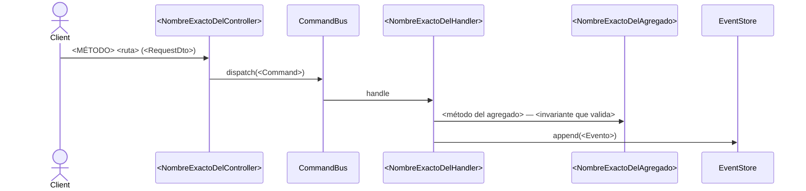

# flow `<use-case>.md` Template (Mermaid, diagrama inline)

Un archivo por caso de uso tocado, en `work/active/sm-<number>/docs/flows/<slug>.md`.
`/sync` lo promueve a `DOCS_UNIT_FLOWS` (`<unidad>/flows/<slug>.md`).

El diagrama del flujo **vive aquí**, inline: un bloque ` ```mermaid ` con un
`sequenceDiagram`. No hay modelo aparte que mantener ni `viewId` al que apuntar — el
diagrama y su semántica se editan juntos, en un solo archivo.

---

````markdown
---
use_case: <slug-kebab>          # p.ej. open-account
module: <module>                # p.ej. accounts
trigger: <rest|cron|queue|domain-event|cli>
entrypoint: <ruta REST | nombre de cron/job | evento de dominio>
command: <Command o Query que dispara>
invariants: [<AC/INV que aplican>]
introduced_by: <spec-XXXX que lo creó>       # no cambia en 'modify'
last_modified_by: <spec-XXXX de este cambio>
status: active                  # active | deprecated | removed
---

# <Nombre del caso de uso>

<1-2 párrafos: qué hace el flujo y cómo viaja el dato entre componentes.>



## Reglas

- **<AC/INV>:** <regla de negocio verificable>.

## Errores

| Condición | Excepción | code | HTTP |
|---|---|---|---|
| <caso> | `<Exception>` | `<CODE>` | <código> |

## Respuesta

<código HTTP + DTO> — o, para triggers no-REST, el efecto observable.
````

## Filling rules

- `trigger` sale de la naturaleza del adaptador primario, no del verbo HTTP.
- Para `trigger: rest`, `entrypoint` debe coincidir con un `path` del `api.yaml` del módulo.
- En `modify`, conservar `introduced_by`; solo mover `last_modified_by`.
- **Identidad estable = anti-duplicado.** El `use_case` (slug) y el `operationId` del
  endpoint son la clave de un flujo. Si tu feature toca un flujo ya documentado, **reusá
  ambos verbatim** — no acuñes un slug nuevo para el mismo `entrypoint`+`command`. Un mismo
  caso de uso vive en un único `flows/<slug>.md`; su evolución es git + `last_modified_by`.

## Convención de identificadores (la valida el CI)

El gate de diagramas verifica que todo identificador nombre un símbolo real del código.
Escribir el diagrama sin respetarla rompe el build.

- **El nombre visible es lo que se verifica**, no el alias: en `participant CB as CommandBus`
  se resuelve `CommandBus`. El alias queda libre para la legibilidad.
- **Usá el nombre exacto de la clase**, puerto o excepción: `ReverseConfirmedTransactionHandler`,
  no «el handler de reversa».
- **Actores externos exentos:** `Client`, `User`, `Usuario`, `Postgres`, `Keycloak`.
- En los `flowchart` de componentes, la forma declara la clase de nodo: `X("Nombre")` debe
  resolver; `X[("tabla")]` (cilindro) y `subgraph` no.

## Traducción de un flujo existente

Si estás migrando o reescribiendo un flujo ya documentado, la traducción es **1:1**: mismo
orden de mensajes, mismos participantes, mismo texto. No enriquezcas con `alt`/`opt` que el
original no tenía — los errores viven en la tabla `## Errores`, que es donde se leen mejor.
