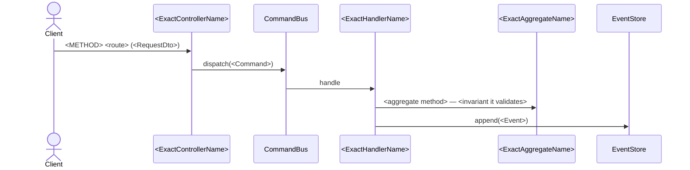

# flow `<use-case>.md` Template (Mermaid, inline diagram)

One file per use case touched, at `work/active/spec-<number>/docs/flows/<slug>.md`.
`/sync` promotes it to `DOCS_UNIT_FLOWS` (`<unit>/flows/<slug>.md`).

The flow's diagram **lives here**, inline: a ` ```mermaid ` block with a
`sequenceDiagram`. There's no separate model to maintain and no `viewId` to point at —
the diagram and its semantics are edited together, in a single file.

---

````markdown
---
use_case: <kebab-slug>          # e.g. open-account
module: <module>                # e.g. accounts
trigger: <rest|cron|queue|domain-event|cli>
entrypoint: <REST route | cron/job name | domain event>
command: <Command or Query it fires>
invariants: [<ACs/INVs that apply>]
introduced_by: <spec-XXXX that created it>   # doesn't change on 'modify'
last_modified_by: <spec-XXXX of this change>
status: active                  # active | deprecated | removed
---

# <Use case name>

<1-2 paragraphs: what the flow does and how the data travels between components.>



## Rules

- **<AC/INV>:** <verifiable business rule>.

## Errors

| Condition | Exception | code | HTTP |
|---|---|---|---|
| <case> | `<Exception>` | `<CODE>` | <status> |

## Response

<HTTP status + DTO> — or, for non-REST triggers, the observable effect.
````

## Filling rules

- `trigger` comes from the nature of the primary adapter, not from the HTTP verb.
- For `trigger: rest`, `entrypoint` must match a `path` in the module's `api.yaml`.
- On `modify`, keep `introduced_by`; only move `last_modified_by`.
- **Stable identity = anti-duplication.** The `use_case` (slug) and the endpoint's
  `operationId` are a flow's key. If your feature touches an already-documented flow,
  **reuse both verbatim** — don't mint a new slug for the same `entrypoint`+`command`.
  A given use case lives in exactly one `flows/<slug>.md`; its evolution is git +
  `last_modified_by`.

## Identifier convention (CI validates it)

The diagram gate verifies that every identifier names a real symbol in the code.
Writing the diagram without respecting it breaks the build.

- **The visible name is what gets verified**, not the alias: in
  `participant CB as CommandBus`, `CommandBus` is what resolves. The alias stays free
  for legibility.
- **Use the exact class name**, port or exception: `ReverseConfirmedTransactionHandler`,
  not "the reversal handler".
- **External actors are exempt:** `Client`, `User`, `Postgres`, `Keycloak`.
- In component `flowchart`s, the shape declares the node class: `X("Name")` must
  resolve; `X[("table")]` (cylinder) and `subgraph` don't.

## Translating an existing flow

If you're migrating or rewriting an already-documented flow, the translation is **1:1**:
same message order, same participants, same text. Don't enrich it with `alt`/`opt` the
original didn't have — errors live in the `## Errors` table, which is where they read
best.

## Language rules

- Frontmatter keys and headings: English (structural — the pipeline reads them by
  name). Prose and diagram labels: `ARTIFACT_LANGUAGE` (profile, language block — falls
  back to `OUTPUT_LANGUAGE`).
- `use_case`, `module`, `entrypoint`, `command` and every identifier in the diagram:
  verbatim from the code — never translated.
