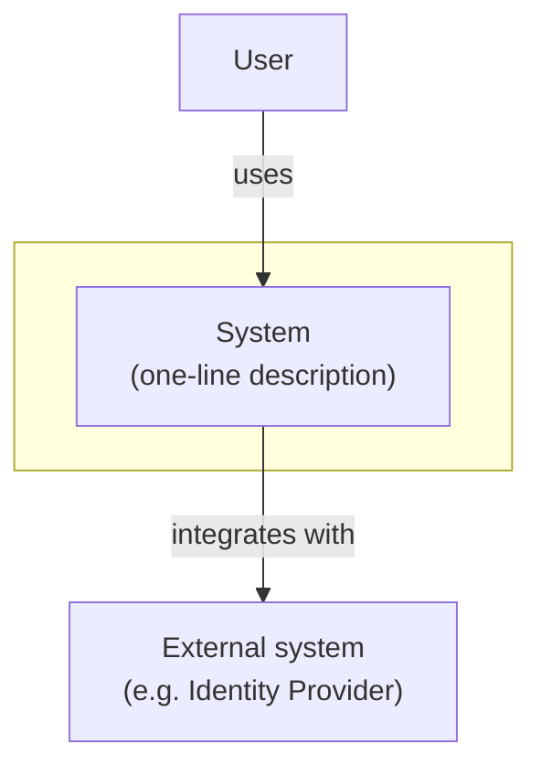

# docs

## Overview

Owns two files, both scoped to the whole system (never a single module):

- **`docs/architecture/context.md`** (C4 Level 1 — System Context): who uses
  the system and which external systems it talks to. No internal detail at
  all — no apps, no DBs, no modules. Changes rarely (only when an actor or a
  real external integration is added/removed).
- **`docs/architecture/containers.md`** (C4 Level 2 — Container): the
  apps/microservices, the shared libs, the databases, and the integrations
  between them. Changes whenever a microservice, a lib, or an integration is
  added/removed.

Level 3 (Component, per module) and each story's sequence diagram **don't**
live here — they're `/design`'s job to produce and `/sync`'s job to promote
to `apps/<app>/docs/<module>/`, because they describe a module's interior,
not global architecture.

**Two modes:**

1. **Bootstrap** — `docs/architecture/` doesn't exist or is empty. Scans the
   repo and generates initial `context.md` + `containers.md`.
2. **Update** — invoked with `spec-<number>` (normally `/sync` invokes it
   automatically when it reads a "Yes" in design.md's "Global Architecture
   Impact" section). Surgically edits whichever file applies
   (`context.md` if an actor/external integration changed, `containers.md`
   if an app/microservice/lib/internal integration changed) using the
   node/edge `design.md` already specified.

**Announce at start:** "Bootstrapping `docs/architecture/`." (Bootstrap
mode) or "Updating `docs/architecture/` with spec-<number>." (Update mode).

---

## Project profile (read first, always)

Read `.agents/profile.yaml` at the root of the current project before anything else.
If it doesn't exist, tell the user to run `/bootstrap` and stop — without a profile you
don't know this project's conventions. The file is a YAML map of named blocks; a key
holding `null` is not configured, so use the fallback this skill declares for it —
never a guessed value.

Tools come from the profile's `ports` block: this skill names the capability it
needs — a port — and the block says which command, agent or MCP tool provides it
here. Run the first adapter that resolves; when one resolves and then fails, report
that failure instead of trying the next. A port with no usable adapter is **unbound**
— see the `Degrades` row below.

Any path, diagram notation or command shown in this document is an example resolution;
the profile's value wins. The keys this skill reads are listed under **Profile keys**
in the `Contract` below.

---

## Contract

What this skill needs, what it leaves in the C4 model, and what it may not do. **Check
every `Requires` row before editing a diagram** — in Update mode the files already
carry work that isn't reproducible, including annotations added by hand.

`DOCS_ARCHITECTURE` (docs block) is where both files live; written throughout this
document as `docs/architecture/`.

**Requires**

| Condition | Check | If it fails |
|---|---|---|
| You are in the project's working directory | `pwd` == `WORKING_DIRECTORY` (absolute path, from the profile) | `cd` there before running anything |
| The mode is unambiguous | Bootstrap if `docs/architecture/context.md` and `containers.md` are absent or empty; Update if an item id was given | Both true (an id given, and no files yet) → Bootstrap first, then apply the update |
| *(Update)* The item's design exists | `design.md` under `work/done/spec-<number>/`, or `work/active/spec-<number>/` if `/sync` hasn't archived it yet | Stop: without the design there is no delta to apply, and this skill never derives one from a git diff |
| *(Update)* The delta is explicit | `design.md`'s `## Global Architecture Impact` says **Yes** and names the level and the concrete node/edge | Ask the user which node/edge to add or remove — never guess. If it says **No**, report it and stop: nothing to promote |
| *(Bootstrap over existing files)* Explicitly confirmed | the user asked to rebuild, not to update | Ask first — a rebootstrap destroys manual annotations, see `Escalates` |

**Produces**

- `docs/architecture/context.md` (C4 Level 1) and/or `containers.md` (Level 2), each
  preceded by its context line (what it represents, when it was last updated)
- in Update mode, **only** the nodes and edges of the delta changed; every other line
  of the file — annotations included — byte for byte as it was
- the two levels kept separate: no app, microservice, lib or DB ever appears in
  `context.md`

**Writes** — nothing outside this list

- `docs/architecture/context.md`
- `docs/architecture/containers.md`

Not the story's artifacts (`design.md` is a read-only input here), not
`docs/decisions.md` (that's `/sync`'s Step 4), and not the per-module docs under
`<unit>/docs/` — Level 3 and each flow's sequence diagram are `/design`'s to produce
and `/sync`'s to promote.

**Never**

- **Forbidden:** regenerating a whole diagram in Update mode. Edit only the delta's
  nodes/edges, in whichever file applies — not both, unless the change genuinely
  touches both levels. Everything else, including hand-written annotations, is
  preserved exactly.
- **Forbidden:** mixing C4 levels. `context.md` never mentions individual
  apps/microservices, DBs or libs — that's `containers.md`. A new <component> changes
  `containers.md`, and only also `context.md` if it alters which actor or external
  system interacts with the system as a whole.
- **Forbidden:** inferring the delta from a git diff, or from the code, when
  `design.md` already states it. The design decided at design time; this skill applies.
- **Forbidden:** `git add`, `git commit`, `git push` and any other state-changing git
  command.

**Escalates**

- A delta that `design.md` leaves missing or ambiguous: ask which node/edge (Step 2).
- A rebootstrap over existing files: confirm explicitly first — it is destructive
  toward manual annotations, unlike an Update.
- Context vs Container when the design wasn't explicit: default to **Container** (the
  level that changes often) and only touch Context for a genuinely new actor or
  external system.

**Degrades**

- `PROJECT_GRAPH` unbound, or its adapter unavailable → the manual survey of the repo's app and
  lib folders is enough (Bootstrap, Step 1); the graph was only ever extra reference.
- `DIAGRAM_FORMAT` other than the default → write the diagrams in the profile's
  notation; the shapes in this document are illustrative.
- `design.md` predating the `## Global Architecture Impact` convention → ask the user
  whether the item touched global architecture, and what the node/edge is.

**Reverting** — both files are tracked by git: `git checkout -- docs/architecture/<file>`
restores the committed version. Because Update is surgical, `git diff` shows exactly
the node and edge that changed, which is what makes the difference between an update
and an accidental rebootstrap visible before anything is committed.

**Profile keys**

- `STORY_ID_PATTERN`, `WORKDIR_DONE`, `WORKDIR_ACTIVE` — the item's id and where its
  design is read from, written as `spec-<number>` and `work/done/spec-<number>/`
- `WORKING_DIRECTORY` — the first `Requires` row
- `DOCS_ARCHITECTURE` — the two files this skill owns
- `DIAGRAM_FORMAT` — the notation of both diagrams
- `PROJECT_NAME` — the system box's label in `context.md`
- `PROJECT_GRAPH` (port) — optional extra reference when bootstrapping
- `COMPONENT_TERM` and the stack block — the term for a deployable unit, and the repo's
  app/lib structure
- `ARTIFACT_LANGUAGE`, `OUTPUT_LANGUAGE`, `IDENTIFIER_LANGUAGE` — see "Output language"

---

## Mode A: Bootstrap

Triggers when `docs/architecture/context.md` or `containers.md` don't exist
(first time in the project).

### Step 1: Survey the current topology

```bash
ls apps/ libs/ 2>/dev/null
```

The folder names are the profile's (stack block) — `apps/`/`libs/` is one common
resolution. For each app: identify its database (read the app's config/env), whether
it's synchronous HTTP or event-sourced, and its known integrations (adapters
under `infrastructure/adapters/` that talk to another app, an external
service, or a broker). For each lib: identify which apps consume it.
Also identify real external systems (identity provider, payment gateways,
third-party APIs) — those go in `context.md`, not each internal app.

If the `PROJECT_GRAPH.run` port is bound, call it with `<out>` and read the result as
an extra reference. Not required: with the port unbound or its adapter unavailable,
the manual survey above is enough.

### Step 2: Generate `context.md` (C4 Level 1)

A single box representing **the whole system** (without splitting internal
apps), the actor(s) that use it, and the real external systems it integrates
with. The shape below is illustrative — write it in the profile's `DIAGRAM_FORMAT`:



### Step 3: Generate `containers.md` (C4 Level 2)

One node per app/microservice, one node per relevant shared lib, one node
per database, and the same external systems from `context.md` but now with
the edge coming from the specific container(s) that actually call them
(not from the whole-system box). Edges for real integrations, not build
dependencies.

### Step 4: Save and report

Save both files under `docs/architecture/`, each preceded by a context line
(what it represents, when it was last generated/updated). Summary: paths
created, how many actors/external systems it surveyed for `context.md`, how
many apps/libs/DBs for `containers.md`.

---

## Mode B: Update

Triggers with `/docs spec-<number>` — invoked by the user or, more
often, by `/sync` when closing a story whose `design.md` already answered
**Yes** in its `## Global Architecture Impact` section (`/design`
determines this at design time; `/sync` only reads and promotes it — no
heuristic detection involved).

### Step 1: Read the already-archived story

Read `design.md` and `context.md` from `work/done/spec-<number>/`. If the story is
still in `work/active/spec-<number>/` because this was invoked before `/sync`
archived it, read from there — not an error, it just means this is running manually
before the full close.

### Step 2: Take the delta from `design.md`

`design.md`'s `## Global Architecture Impact` already carries the
affected level (Context/Container), the type of change, and the concrete
node/edge to add/remove — no need to re-derive it. If `/sync` invoked this
skill, it usually already passed it along in the invocation prompt; if run
manually, read it directly from that section.

If the section is missing or ambiguous about the exact node/edge (a story
designed before this convention existed), ask the user instead of guessing.

### Step 3: Edit surgically

Open whichever file applies and modify **only** the nodes/edges from the
Step 2 delta — add what's new, remove what no longer applies. Don't touch
the rest of the diagram, or the other file if the change doesn't belong
there.

### Step 4: Report

Summary: which file(s) were touched and what was added/removed from each.

---

## Examples

### Example 1: bootstrap in a mono-repo

User says: "/docs"

Actions:
1. Neither `context.md` nor `containers.md` exist → Bootstrap mode.
2. `context.md`: one actor (User) + one external system (Keycloak, IdP).
3. `containers.md`: `apps/finances` (monolith, own DB, frozen) and
   `apps/ledger` (event sourcing + CQRS, own DB, active), `libs/shared`,
   each app's integration with Keycloak.

Result: `docs/architecture/` gets created with the repo's current topology,
correctly split across the two levels.

### Example 2: /sync promotes a cross-cutting story already flagged by /design

Context: `/sync spec-0015` closes a story that added `apps/notifications`
(new microservice, consumes ledger events via a new adapter). It doesn't add
any new actor or external system. `design.md` already carries:

```markdown
## Global Architecture Impact

**Does it touch global architecture?** Yes.

- **Level:** Container (Level 2)
- **Change:** new microservice
- **Concrete node/edge:** add node `notifications`; edge
  `ledger -. events .-> notifications`.
```

Actions:
1. `/sync` reads the section — it says Yes, level Container.
2. Invokes `/docs spec-0015`, passing along the already-specified
   node/edge.
3. Update mode: adds the `notifications` node and the
   `ledger -. events .-> notifications` edge directly to
   **`containers.md`** — no need to infer anything from a diff. `context.md`
   isn't touched because `design.md` marked the level as Container, not
   Context.

Result: `containers.md` reflects the new microservice; `context.md` stays
untouched because the change didn't belong there.

---

## Common Issues

| Issue | Cause | Resolution |
|---|---|---|
| `docs/architecture/` doesn't exist yet | Never run in Bootstrap mode | Run `/docs` with no arguments first |
| Unclear whether the change is Context or Container | The design wasn't explicit about scope | Default to Container (the level that changes more often); only touch Context if there's a genuinely new actor/external system |
| The delta isn't clear from `design.md` | The design wasn't explicit about the change's scope | Ask the user which node/edge to add/remove — don't guess |
| Asked to "regenerate the whole diagram" | Scope confusion | Remember Update is surgical; a full rebootstrap is a different, destructive action toward manual annotations — confirm explicitly with the user first |
| `design.md` marked "No" but it actually touched global architecture | `/design` misjudged the impact at design time | Fix the "Global Architecture Impact" section in `design.md` and run `/docs spec-<number>` manually — there's no `/sync` heuristic to compensate |
| Asked for a design-decisions log | Out of this skill's scope | That's `docs/decisions.md` (repo root), maintained by `/sync` directly in its Step 4 — it doesn't live inside `docs/architecture/` |

---

## Output language
**Conversational output** follows `~/.agents/references/chat-conventions.md` - the six blocks (announce, progress, question, summary, stop, handoff).

**Artifact prose follows `ARTIFACT_LANGUAGE`** (profile, language block — falls back to
`OUTPUT_LANGUAGE` if the project doesn't declare it): the prose of
`docs/architecture/context.md` and `containers.md`, plus the node and edge labels of
the diagrams. Never translate them to English on your own.

The section name this skill reads in `design.md` (`## Global Architecture Impact`) is
a structural contract with `/design` — always English, as are the node **IDs**, app
and service names, and any other identifier (`IDENTIFIER_LANGUAGE`).

**Chat interaction follows the user's language** (`OUTPUT_LANGUAGE` in the profile).
The message samples in this document are written in English; render them in the
user's language when that differs.
